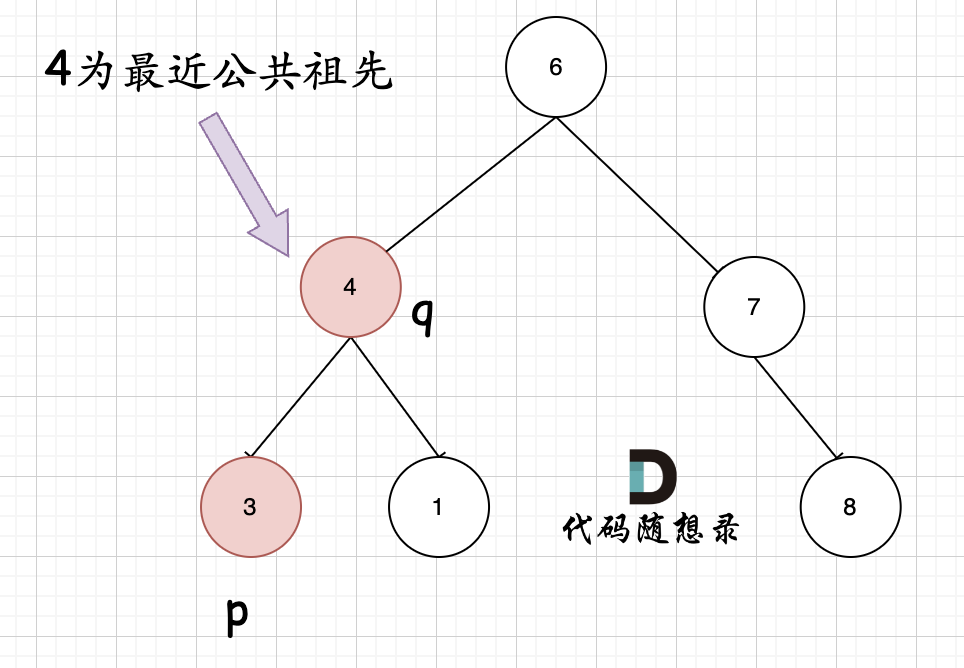

# 236. 二叉树的最近公共祖先

闭眼猛猛敲代码，结果只通过两个测试案例。

```c++
/**
 * Definition for a binary tree node.
 * struct TreeNode {
 *     int val;
 *     TreeNode *left;
 *     TreeNode *right;
 *     TreeNode(int x) : val(x), left(NULL), right(NULL) {}
 * };
 */
class Solution {
public:
    bool dfs(TreeNode* root, TreeNode* target, vector<TreeNode*>& path) {
        if (root == NULL) return false;
        path.push_back(root);
        if (root == target) {
            return true;
        }
        if (dfs(root->left, target, path)) return true;
        if (dfs(root->right, target, path)) return true;
        path.pop_back();
        return false;
    }

    TreeNode* lowestCommonAncestor(TreeNode* root, TreeNode* p, TreeNode* q) {
        vector<TreeNode*> vp;
        vector<TreeNode*> vq;
        dfs(root, p, vp);
        dfs(root, q, vq);
        reverse(vp.begin(), vp.end());
        reverse(vq.begin(), vq.end());
        int minSize = min(vp.size(), vq.size());
        int i = 0;
        for (i = minSize - 1; i >= 0; i--) {
            if (vq[i] != vp[i]) {
                return vq[i + 1];
            }
        }
        return NULL;
    }
};
```

首先我忘了怎么用dfs来查找路径了，以前都是写Python代码，用的显示栈去查找的。

后面的`reverse`和从后往前遍历的想法非常混乱，我用`reverse`是因为我以为`path`的顺序是从`target`到根节点的。

然而实际上`path`是从根节点到`target`的，这里不应该有`reverse`。

还有就是从后往前遍历，其实路径的相同部分都在两个`path`的前面，应该从前往后遍历才对。

改了一下，过了
```c++
/**
 * Definition for a binary tree node.
 * struct TreeNode {
 *     int val;
 *     TreeNode *left;
 *     TreeNode *right;
 *     TreeNode(int x) : val(x), left(NULL), right(NULL) {}
 * };
 */
class Solution {
public:
    bool dfs(TreeNode* root, TreeNode* target, vector<TreeNode*>& path) {
        if (root == NULL) return false;
        path.push_back(root);
        if (root == target) {
            return true;
        }
        if (dfs(root->left, target, path)) return true;
        if (dfs(root->right, target, path)) return true;
        path.pop_back();
        return false;
    }

    TreeNode* lowestCommonAncestor(TreeNode* root, TreeNode* p, TreeNode* q) {
        vector<TreeNode*> vp;
        vector<TreeNode*> vq;
        dfs(root, p, vp);
        dfs(root, q, vq);
        int minSize = min(vp.size(), vq.size());
        TreeNode* check = NULL;
        for (int i = 0; i < minSize; i++) {
            if (vq[i] == vp[i]) {
                check = vq[i];
            } else break;
        }
        return check;
    }
};
```

但是很明显上面那种做法不是很好的做法，所以我又学了一下文章讲解的做法。

```c++
/**
 * Definition for a binary tree node.
 * struct TreeNode {
 *     int val;
 *     TreeNode *left;
 *     TreeNode *right;
 *     TreeNode(int x) : val(x), left(NULL), right(NULL) {}
 * };
 */
class Solution {
public:
    TreeNode* lowestCommonAncestor(TreeNode* root, TreeNode* p, TreeNode* q) {
        if (root == q || root == p || root == NULL) return root;
        TreeNode* left = lowestCommonAncestor(root->left, p, q);
        TreeNode* right = lowestCommonAncestor(root->right, p, q);
        if (left != NULL && right != NULL) return root;
        else if (left != NULL && right == NULL) return left;
        else if (left == NULL && right != NULL) return right;
        return NULL;
    }
};
```

文章讲解了树的一条边的搜索方法，适用于寻找到某个节点的路径
```c++
if (递归函数(root->left)) return ;

if (递归函数(root->right)) return ;
```

搜索整棵树的方法
```c++
left = 递归函数(root->left);  // 左
right = 递归函数(root->right); // 右
left与right的逻辑处理;         // 中 
```

这道题目需要搜索整棵树，举个例子


如果只是搜索从根节点到p的路径，那么找到p之后就直接返回路径了，q就不会再搜索了。

回到题目上来，这道题的核心在于判断根节点的两个子节点是否分别为p，q，或者根节点的两棵子树是否包含p，q。

代码表示如下：
```c++
TreeNode* left = lowestCommonAncestor(root->left, p, q);
TreeNode* right = lowestCommonAncestor(root->right, p, q);
if (left != NULL && right != NULL) return root;
else if (left != NULL && right == NULL) return left;
else if (left == NULL && right != NULL) return right;
```

上面的两种情况很好理解，还有一个特殊情况，那就是两个节点中的一个节点是最近公共祖先的情况，如下图所示。



这种情况在代码中的表示为：
```c++
if (root == q || root == p || root == NULL) return root;
```

如果p和q其中一个节点是两个的最近公共祖先，那么这个公共祖先就是最终要返回的节点；如果就算q不在“同一侧”，这行也是适用的，这行代码就表示往下搜索时，如果根节点是q或者p，就可以进行回溯。

一图胜千言

