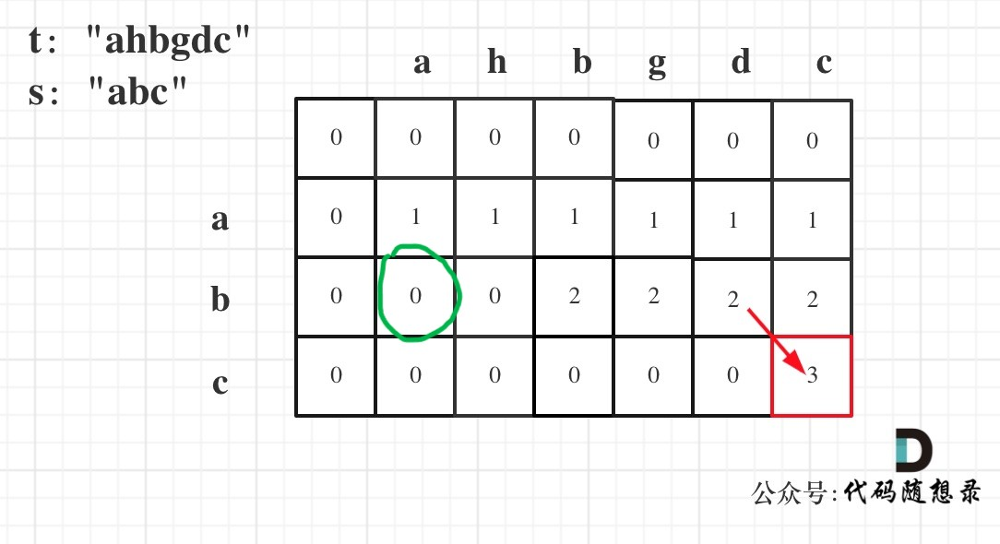

# 392. 判断子序列

## 双指针
在`t`中从头开始往后查找`s`最前面的字符，如果查找到，那么指向`s`的 **前面的字符** 往后移动一位，直到这个指针指向的下标的值等于`s.size()`。
```c++
class Solution {
public:
    bool isSubsequence(string s, string t) {
        if (s.size() > t.size()) return false;
        if (s.size() == 0) return true;
        int j = 0;
        for (int i = 0; i < t.size(); i++) {
            if (t[i] == s[j]) {
                j++;
            }
            if (j >= s.size()) return true;
        }
        return false;
    }
};
```

## 动态规划
先不着急`dp`三部曲，这里有两个特殊情况：
- `s.size() > t.size()`，这种情况`s`不可能是`t`的子序列，直接`return false`
- `s.size() == 0`，`s`是空子序列，符合题意，直接`return true`

1. `dp`数组下标含义
    `dp[i][j]`表示以第`i - 1`个字符为结尾的`s`与以第`j - 1`个字符为结尾的`t`的最长公共子序列的长度（这个只是间接目的，最终目的是检查`s`是否为`t`的子序列）。
2. 递推公式
    这里和1143. 最长公共子序列有点不同：
    - 最长公共子序列那道题中，并不知道`s`和`t`谁更加长，这道题里`s`要比`t`短
    - 这里要从`t`中查找的子序列是是整个`s`，而不是`s`的子序列

    所以，递推公式为：
    - 如果`s[i] == t[j]`，那么有`dp[i][j] = dp[i - 1][j - 1] + 1`
    - 否则，`dp[i][j] = dp[i][j - 1]`

    为什么不是`dp[i][j] = max(dp[i][j - 1], dp[i - 1][j])`？

    借用代码随想录网站上的图片示例：

    
    
    当`i == 1`时，`s[:i]`无论`t`中有多少个a（数量大于0），他们的公共子序列的长度最多只会是1。

    当`i == 2`时，`s[:i] == "ab"`，若此时`j == 1`，即`a[:j] == "a"`，按照 **最长公共子序列** 里的思路，绿色格子的值应为1，因为它们有最长公共子序列`"a"`。但是这里最终要查找的并不是`s`和`t`的最长公共子序列，所以这里没有必要取`dp[i - 1][j]`的值，因为我们要让尽可能多的`s`中的字符能够在`t`中找到。

    `dp[i][j] = dp[i][j - 1]`发生在`s[i - 1] != t[j - 1]`，这相当于`t`中新检查的元素不属于`s`的，让`t`回退一个字符是的结果和这个是一样的。

3. 初始化
    全部初始化为0即可，相当于空字符串和空字符串找子序列。

```c++
class Solution {
public:
    bool isSubsequence(string s, string t) {
        if (s.size() > t.size()) return false;
        if (s.size() == 0) return true;
        vector<vector<int>> dp(s.size() + 1, vector<int>(t.size() + 1, 0));
        for (int i = 1; i <= s.size(); i++) {
            for (int j = i; j <= t.size(); j++) {
                if (s[i - 1] == t[j - 1]) {
                    dp[i][j] = dp[i - 1][j - 1] + 1;
                } else {
                    dp[i][j] = dp[i][j - 1];
                }
                if (dp[i][j] == s.size()) return true;
            }
        }
        return false;
    }
};
```