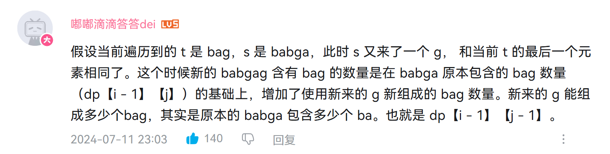

# 115. 不同的子序列
非常难的一道题，看了视频讲解和文章讲解都没有看明白，然后又去看leetcode上的题解，还是没看明白，最后在视频讲解下面的评论区里找到了救赎之道。



## 思路
首先考虑`s[i - 1] == t[j - 1]`的情况。

1. 假设前一个遍历到的`t == "bag", s == "babga"`，往下一个i开始j的遍历，遍历到
    `t == 'bag', s == "babgag"`，可以看见`s`多出来了一个`'g'`，刚好等于`t`的最后一个字符
2. 在`t.end == s.end`的情况下，我们想要知道新的`s`里面能有多少个子序列是等于`t == "bag"`的，只需要考虑以下两种情况：
    - 选取`t`和`s`的最后的`g`放在一边，查找`s == "babga"`中有多少个`"ba"`
    - 不选取`t`的最后一个字符，查看`s == "babga"`中有多少个子序列为`"bag"`

    第二种情况比较难想明白，可以这样去理解，如果`s == "babga"`中已经有了`"bag"`的子序列，那么多加入一个单独的`g`，不会影响`s == "babga"`原本已经含有的`"bag"`的数量。
    
    综合两种情况来看，我们要的是原本`s == "babga"`中含有的`"bag"`的子序列的数量 加上 `s == "babga"`中所含有的能够和`'g'`组成`"bag"`的`"ba"`的数量。

然后是`s[i - 1] != t[j - 1]`的情况。

这个情况很好理解，相当于是`t`多了一个`s`末尾没有的字符，或者是`s`中多了一个`t`末尾没有的字符，又因为这里是从`s`中找`t`，直接令`dp[i][j] = dp[i - 1][j]`。
## 代码
```c++
class Solution {
public:
    int numDistinct(string s, string t) {
        if (s.size() < t.size()) return 0;
        vector<vector<uint64_t>> dp(s.size() + 1, vector<uint64_t>(t.size() + 1, 0));
        // 初始化，因为在s中总能找到空字符串作为子序列，此处初始化为1
        for (int i = 0; i <= s.size(); i++) {
            dp[i][0] = 1;
        } 
        for (int i = 1; i <= s.size(); i++) {
            for (int j = 1; j <= t.size(); j++) {
                if (s[i - 1] == t[j - 1]) {
                    dp[i][j] = dp[i - 1][j - 1] + dp[i - 1][j];
                } else {
                    dp[i][j] = dp[i - 1][j];
                }
            }
        }
        return dp[s.size()][t.size()];
    }
};
```